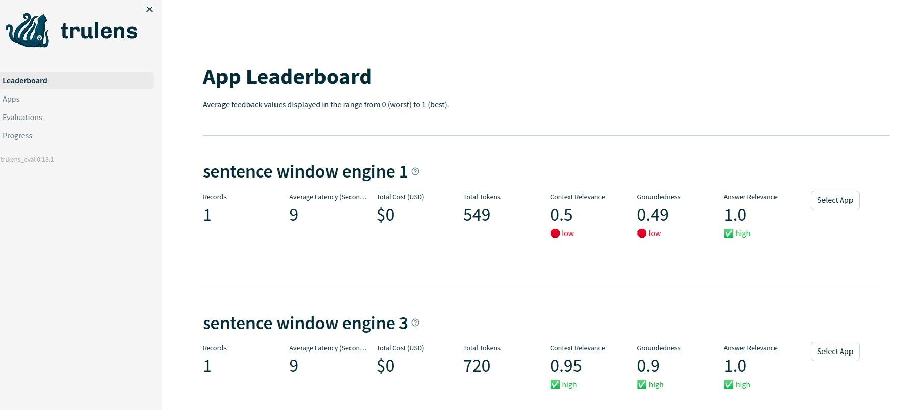
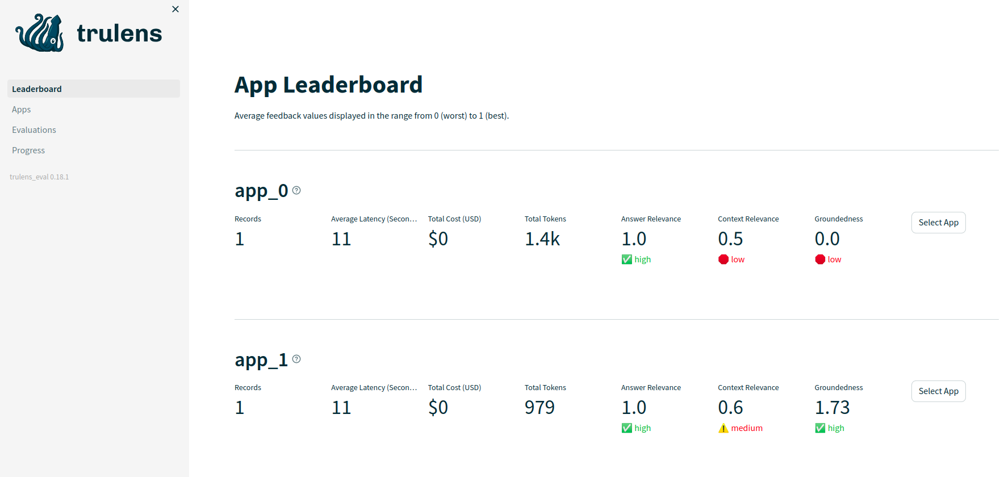

# Advanced Retriever
## Sentence window

[Code](./sentence_window_retrieval.ipynb)

## Auto merging

[Code](./auto_merging_retrieval.ipynb)

# Metrics
[Ragas](https://docs.ragas.io/en/latest/concepts/metrics/index.html)

- `Context precision` measures the signal-to-noise ratio of the retrieved context.
This metric is computed using the `question` and the `contexts` .

- `Context recall` measures if all the relevant information required to answer the question was retrieved. This metric is computed based on the `ground_truth` (this is the only metric in the framework that relies on human-annotated ground
truth labels) and the `contexts` .

- `Faithfulness` measures the factual accuracy of the generated answer. The number of correct statements from the given contexts is divided by the total
number of statements in the generated answer. This metric uses the `question` , `contexts` and the `answer` .

- `Answer relevancy` measures how relevant the generated answer is to the question. This metric is computed using the `question` and the `answer` . For example, the answer “France is in western Europe.” to the question “Where is France and what is it’s capital?” would achieve a low answer relevancy because it only answers half of the question.

# Eval & Monitor
[Trulens-eval](https://www.trulens.org/trulens_eval/llama_index_quickstart/#initialize-feedback-functions)

